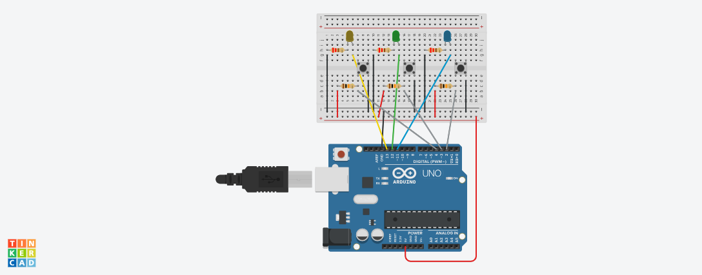
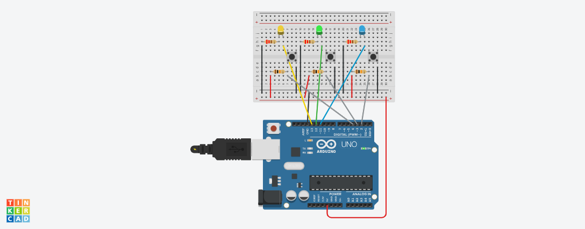

# Arduino LED Toggle Project

This is a simple Arduino project that uses three buttons to toggle three LEDs independently.

## Project Description

- Three LEDs connected to pins 11, 12, and 13.
- Three push buttons connected to pins 2, 3, and 4.
- Pressing each button toggles the state of the corresponding LED (ON/OFF).
- Debounce implemented with small delays and wait for button release to avoid multiple toggles from a single press.

## How to Use

1. Connect the LEDs and buttons to the Arduino as specified in the code.
2. Upload the `led_toggle.ino` sketch to your Arduino board using the Arduino IDE.
3. Press each button to turn the corresponding LED ON or OFF.

## Code Overview

- `ledPins[]` array holds LED pin numbers.
- `btnPins[]` array holds button pin numbers.
- `states[]` array tracks the current ON/OFF state of each LED.
- The main loop checks for button presses, debounces input, waits for release, and toggles LED states accordingly.

## Files

- `led_toggle.ino` - Arduino sketch source code.
- `circuit_diagram.png` → Screenshot of the circuit from Tinkercad.

---

Created by Meznah Alammash

